<div align="center">



# 🏴‍☠️ JoyBoy

### *The Ultimate Modular Parser Ecosystem for Manga, Manhwa & Webtoons*

[](https://www.typescriptlang.org/)
[](https://nodejs.org/)
[](LICENSE)
[](CONTRIBUTING.md)

**Cross-Platform** • **Type-Safe** • **Extensible** • **Production-Ready**

[Quick Start](#-quick-start) • [Documentation](#-packages) • [Examples](#-usage-examples) • [Contributing](#-contributing)

</div>

---

## 🌟 Overview

**JoyBoy** is a modern, TypeScript-first parser ecosystem inspired by [Kotatsu's](https://github.com/KotatsuApp/Kotatsu) extension architecture. It provides a unified, modular framework for fetching manga, manhwa, and webtoon content from various sources across the web.

### Why JoyBoy?

- 🎯 **Unified API**: Consistent interface across all sources
- 🔒 **Type-Safe**: Full TypeScript support with strict typing  
- 🌐 **Cross-Platform**: Works in Node.js, browsers, and React Native
- 🔌 **Extensible**: Easy-to-create parser plugins
- ⚡ **Performance**: Tree-shakeable ESM bundles
- 🛡️ **Reliable**: Built-in retry logic and error handling

---

## ✨ Features

| Feature | Description |
|---------|-------------|
| 🏗️ **Modular Architecture** | Independent parser packages with dynamic loading |
| 📦 **Cross-Platform** | Node.js 18+, browsers, and React Native support |
| 🔍 **Type-Safe** | Full TypeScript with comprehensive type definitions |
| 🚀 **Dynamic Loading** | Load parsers on-demand to reduce bundle size |
| 🔎 **Source Registry** | Discover and manage available parsers |
| ⚡ **Performance** | Tree-shakeable, lazy loading, request caching |
| 🛡️ **Reliability** | Structured errors, retry mechanisms, rate limiting |

---

## 📦 Packages

| Package | Version | Description |
|---------|---------|-------------|
| [@joyboy/types](./packages/types) | 1.0.0 | TypeScript definitions and interfaces |
| [@joyboy/core](./packages/core) | 1.0.0 | Core SDK, runtime, and base classes |
| [@joyboy/source-registry](./packages/source-registry) | 1.0.0 | Source catalog with search and filtering |
| [@joyboy/source-mangadex](./packages/source-mangadex) | 1.0.0 | MangaDex parser implementation |
| [@joyboy/source-template](./packages/source-template) | 1.0.0 | CLI tool for creating new parsers |

---

## 🚀 Quick Start

### Installation

```bash
npm install @joyboy/core @joyboy/source-mangadex
```

### Basic Usage

```typescript
import { JoyBoy } from '@joyboy/core';

// Load a parser
await JoyBoy.loadSource('@joyboy/source-mangadex');

// Get the source
const mangadex = JoyBoy.getSource('mangadex');

// Search for manga
const results = await mangadex.search('One Piece');

// Get manga details
const manga = await mangadex.getMangaDetails(results[0].id);

// Get chapters
const chapters = await mangadex.getChapters(manga.id);

// Get chapter pages
const pages = await mangadex.getChapterPages(chapters[0].id);

console.log(`Found ${results.length} results`);
console.log(`${manga.title} has ${chapters.length} chapters`);
```

---

## 📚 Usage Examples

### Node.js Application

```typescript
import { JoyBoy } from '@joyboy/core';
import { getAllSources } from '@joyboy/source-registry';

async function main() {
  // Load all available sources
  const sources = getAllSources();
  for (const source of sources) {
    await JoyBoy.loadSource(source.packageName);
  }
  
  // Search across all sources
  const results = await JoyBoy.searchAll('Naruto');
  
  for (const [sourceId, manga] of results) {
    console.log(`${sourceId}: ${manga.length} results`);
  }
}

main();
```

### React Native App

```typescript
import React, { useState, useEffect } from 'react';
import { View, Text, FlatList, Image } from 'react-native';
import { JoyBoy } from '@joyboy/core';

function MangaList() {
  const [manga, setManga] = useState([]);

  useEffect(() => {
    async function load() {
      await JoyBoy.loadSource('@joyboy/source-mangadex');
      const source = JoyBoy.getSource('mangadex');
      const results = await source.search('One Piece');
      setManga(results);
    }
    load();
  }, []);

  return (
    <FlatList
      data={manga}
      renderItem={({ item }) => (
        <View>
          <Image source={{ uri: item.coverUrl }} />
          <Text>{item.title}</Text>
        </View>
      )}
    />
  );
}
```

### Web Application (Next.js)

```typescript
'use client';

import { useState, useEffect } from 'react';
import { JoyBoy } from '@joyboy/core';

export default function MangaSearch() {
  const [manga, setManga] = useState([]);
  const [query, setQuery] = useState('');

  useEffect(() => {
    JoyBoy.loadSource('@joyboy/source-mangadex');
  }, []);

  const handleSearch = async () => {
    const source = JoyBoy.getSource('mangadex');
    const results = await source.search(query);
    setManga(results);
  };

  return (
    <div>
      <input value={query} onChange={e => setQuery(e.target.value)} />
      <button onClick={handleSearch}>Search</button>
      <div>
        {manga.map(item => (
          <div key={item.id}>
            
            <h3>{item.title}</h3>
          </div>
        ))}
      </div>
    </div>
  );
}
```

---

## 🔨 Creating Custom Parsers

### Using the CLI

```bash
npx @joyboy/source-template
```

Follow the prompts to generate a complete parser project.

### Manual Implementation

```typescript
import { BaseSource } from '@joyboy/core';
import type { Manga, Chapter, Page } from '@joyboy/types';

export default class MyParser extends BaseSource {
  id = 'myparser';
  name = 'My Parser';
  version = '1.0.0';
  baseUrl = 'https://example.com';

  async getMangaDetails(id: string): Promise<Manga> {
    const html = await this.fetchHtml(`${this.baseUrl}/manga/${id}`);
    // Parse and return manga data
    return { /* ... */ };
  }

  async getChapters(mangaId: string): Promise<Chapter[]> {
    // Implementation
    return [];
  }

  async getChapterPages(chapterId: string): Promise<Page[]> {
    // Implementation
    return [];
  }
}
```

See the [Creating Custom Parsers Guide](./docs/creating-parsers.md) for detailed instructions.

---

## 🏛️ Architecture

```
┌─────────────────────────────────────┐
│       Your Application              │
│   (Node/Browser/React Native)       │
└──────────────┬──────────────────────┘
               │
       ┌───────▼────────┐
       │  JoyBoy Core   │
       │    Runtime     │
       └───────┬────────┘
               │
    ┌──────────┼──────────┐
    ▼          ▼          ▼
┌────────┐ ┌────────┐ ┌────────┐
│Source 1│ │Source 2│ │Source 3│
└────────┘ └────────┘ └────────┘
```

---

## 📖 Documentation

- [Core SDK Documentation](./packages/core/README.md)
- [Types Reference](./packages/types/README.md)
- [Source Registry Guide](./packages/source-registry/README.md)
- [Creating Parsers](./docs/creating-parsers.md)
- [API Reference](./docs/api-reference.md)
- [Migration Guide](./docs/migration.md)

---

## 🌐 Available Sources

| Source | Status | Languages | NSFW | Features |
|--------|--------|-----------|------|----------|
| [MangaDex](./packages/source-mangadex) | ✅ Official | 10+ | ❌ | Search, Filters, Latest, Popular |

[See all available sources →](./docs/sources.md)

Want to add a source? Check out the [Contributing Guide](./CONTRIBUTING.md)!

---

## 🛠️ Development

### Prerequisites

- Node.js >= 18.0.0
- pnpm >= 8.0.0

### Setup

```bash
# Clone the repository
git clone https://github.com/yourusername/joyboy.git
cd joyboy

# Install dependencies
pnpm install

# Build all packages
pnpm build

# Run tests
pnpm test

# Development mode
pnpm dev
```

### Project Structure

```
joyboy/
├── packages/
│   ├── core/              # Core SDK
│   ├── types/             # Type definitions
│   ├── source-registry/   # Source catalog
│   ├── source-mangadex/   # MangaDex parser
│   └── source-template/   # Parser template
├── docs/                  # Documentation
├── examples/              # Example projects
└── scripts/               # Build scripts
```

---

## 📊 Roadmap

- [x] Core SDK and runtime
- [x] TypeScript type definitions
- [x] Source registry system
- [x] MangaDex parser
- [ ] More source parsers
  - [ ] MangaKakalot
  - [ ] Webtoon
  - [ ] Asura Scans
- [ ] Advanced features
  - [ ] Persistent caching (IndexedDB)
  - [ ] Download manager
  - [ ] Reading history
  - [ ] Bookmark system
- [ ] Developer tools
  - [ ] Parser testing framework
  - [ ] CLI debugging tools
  - [ ] Browser extension

---

## 🤝 Contributing

We welcome contributions! Please see our [Contributing Guide](./CONTRIBUTING.md) for details.

### Ways to Contribute

- 🐛 Report bugs
- 💡 Suggest features
- 📝 Improve documentation
- 🔌 Create new parsers
- 🧪 Write tests

---

## 📄 License

This project is licensed under the MIT License - see the [LICENSE](./LICENSE) file for details.

---

## 🙏 Acknowledgments

- Inspired by [Kotatsu](https://github.com/KotatsuApp/Kotatsu) Android app
- Thanks to all [contributors](./CONTRIBUTORS.md)
- Built with ❤️ by the JoyBoy community

---

<!-- ## 📞 Community & Support -->

<!-- - 💬 [Discord Server](https://discord.gg/joyboy)
- 🐦 [Twitter](https://twitter.com/joyboyparser)
- 📧 [Email](mailto:support@joyboy.dev)
- 🐛 [Issue Tracker](https://github.com/yourusername/joyboy/issues) -->

<!-- --- -->

<div align="center">

**[⬆ Back to Top](#-joyboy)**

Made with ❤️ by the JoyBoy community

</div>


